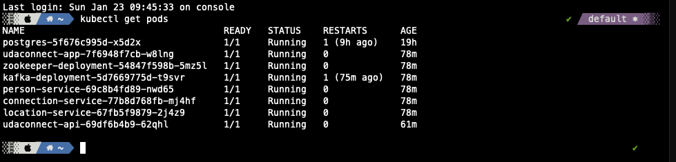

# UdaConnect - Microservices
## Overview
### Background
Conferences and conventions are hotspots for making connections. Professionals in attendance often share the same interests and can make valuable business and personal connections with one another. At the same time, these events draw a large crowd and it's often hard to make these connections in the midst of all of these events' excitement and energy. To help attendees make connections, we are building the infrastructure for a service that can inform attendees if they have attended the same booths and presentations at an event.

## Getting started
The existing application has been refactored into microservices however most of the previous stes are still valid on this new version

## How to run

First check the preriquisites and then follow the install/deploy steps

### Prerequisites
We will be installing the tools that we'll need to use for getting our environment set up properly.
1. [Set up `kubectl`](https://rancher.com/docs/rancher/v2.x/en/cluster-admin/cluster-access/kubectl/)
2. [Install VirtualBox](https://www.virtualbox.org/wiki/Downloads) with at least version 6.0
3. [Install Vagrant](https://www.vagrantup.com/docs/installation) with at least version 2.0

### 1. Initial Setup
In this project's root, run `vagrant up`. 

```bash
$ vagrant up
```

Then access via ssh

```bash
$ vagrant ssh
```

Inside the virtual machine execute the following command and copy it result:

```bash
$ cat /etc/rancher/k3s/k3s.yaml
```

Exit the virtual machine and paste it into the ~/.kube/config file if the ~/.kube folder doesn't exists please create it.

```bash
$ nano ~/.kube/config
```

### 2. Deploy to kubernetes

1. `kubectl apply -f deployment/db-configmap.yaml` - Set up environment variables for the pods
2. `kubectl apply -f deployment/db-secret.yaml` - Set up secrets for the pods
3. `kubectl apply -f deployment/postgres.yaml` - Set up a Postgres database running PostGIS
4. `kubectl apply -f deployment/kafka-configmap.yaml` - Set up the kafka configmaps
5. `kubectl apply -f deployment/zookeeper.yaml` - Set up the zookeeper service
5. `kubectl apply -f deployment/kafka.yaml` - Set up the kafka cluster
6. `kubectl apply -f deployment` - Deploys the application containers and services

### 3. Seeding the database

Please execute the following command:

```shell
$ kubectl get po 
```

And copy the postgress pod name, then paste it to replace the <POD_NAME> placeholder with that name

```bash
$ sh scripts/run_db_command.sh <POD_NAME>
```

### 4. Check if it works
Once the project is up and running, you should be able to see 8 deployments and 8 services in Kubernetes:
`kubectl get pods` and `kubectl get services` - should both return `udaconnect-app`, `udaconnect-api`, `zookeeper-deployment`, `kafka-deployment`, `connection-service`, `person-service`, `location-service`  and `postgres`




These pages should also load on your web browser:
* `http://localhost:30001/` - OpenAPI Documentation
* `http://localhost:30001/api/` - Base path for API
* `http://localhost:30000/` - Frontend ReactJS Application

Alternative you could use the included postman collection to test the created services:

[Postman](./docs/postman.json)
